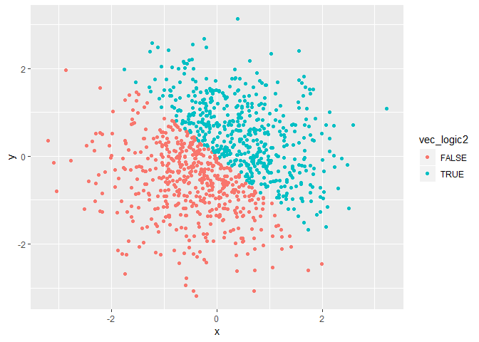
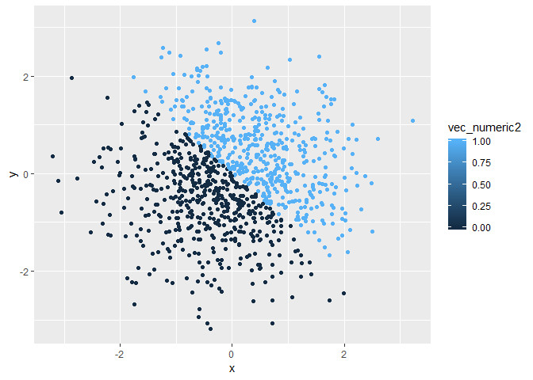
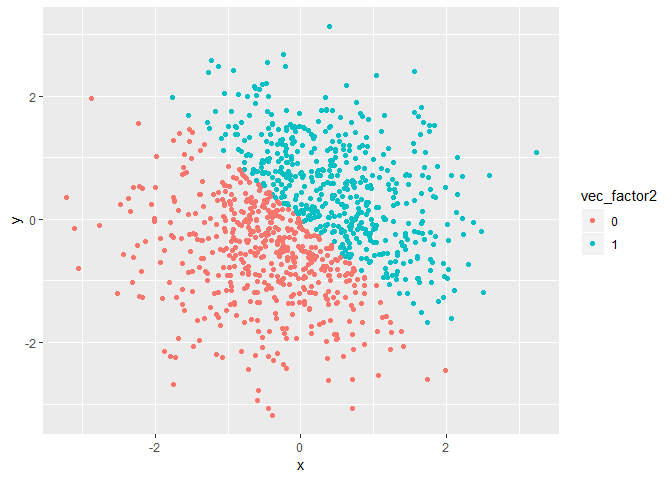

p8105\_hw1\_bhb2128
================
Brennan Baker
September 13, 2018

-   [Problem 1](#problem-1)
-   [Problem 2](#problem-2)

Problem 1
---------

``` r
library(tidyverse)
```

    ## -- Attaching packages ------------------------------------------------------------- tidyverse 1.2.1 --

    ## v ggplot2 3.0.0     v purrr   0.2.5
    ## v tibble  1.4.2     v dplyr   0.7.6
    ## v tidyr   0.8.1     v stringr 1.3.1
    ## v readr   1.1.1     v forcats 0.3.0

    ## -- Conflicts ---------------------------------------------------------------- tidyverse_conflicts() --
    ## x dplyr::filter() masks stats::filter()
    ## x dplyr::lag()    masks stats::lag()

Data frame with 4 vectors. I tried making it like the one presented in class, where the vectors are created inside the tibble function. That didn't work because refering to vec\_numeric when creating vec\_logic produced the following error "Error in eval\_tidy(xs\[\[i\]\], unique\_output) : object 'vec\_numeric' not found". I tried both "vec\_logic &lt;- vec\_numeric &gt; 2" and "vec\_logic &lt;- problem\_1\_df\[1\] &gt; 2".

Here is the code that produced an error (I set eval = FALSE)

``` r
problem_1_df <- tibble(
    vec_numeric <- runif(10, min = 0, max = 5),
    vec_logic <- vec_numeric > 2,
    vec_character <- c("My", "name", "is", "Brennan", "and", "I", "love", "data", "science", "yay"),
    vec_factor <- factor(c("blue", "red", "green", "blue", "red", "green", "blue", "red", "green", "blue" ))
)
```

Here is the data frame that worked

``` r
vec_numeric <- runif(10, min = 0, max = 5)
vec_logic <- vec_numeric > 2
vec_character <- c("My", "name", "is", "Brennan", "and", "I", "love", "data", "science", "yay")
vec_factor <- factor(c("blue", "red", "green", "blue", "red", "green", "blue", "red", "green", "blue" ))

problem_1_df <- tibble(
  vec_numeric,
  vec_logic <- vec_numeric > 2,
  vec_character,
  vec_factor
)
```

I am able to calculate the mean of the numeric and the logical vector, but not the mean of the character or factor vector, because elements in those vectors have no numerical value. The mean of the numeric vector is the mean of the 10 numbers, for the logic vector, I think FALSE counts as 0 and TRUE counts as 1 when calculating the mean.

This data converts the vectors to different types

``` r
as.numeric(vec_logic)
as.numeric(vec_character)
as.numeric(vec_factor)
```

Converiting the logic vector to numeric, FALSE becomes 0 and TRUE becomes 1. With the character vector, everything becomes NA. The factors were converted to numeric alphabetically (e.g. a, b, c = 1, 2, 3).

Here is some more type conversion

``` r
as.numeric(as.factor(vec_character))
as.numeric(as.character(vec_factor))
```

Character to factor to numeric works because the characters become factors, and then the factors can be converted to numeric alphabetically. Factor to character to numeric results in a vector of NAs, because once the factors are converted to characters, they have no numerical value.

Problem 2
---------

Create data frame for problem 2

``` r
x <- rnorm(1000)
y <- rnorm(1000)
vec_logic2 <- x + y > 0
vec_numeric2 <- as.numeric(vec_logic2)
vec_factor2 <- as.factor(vec_numeric2)

problem_2_df <- tibble(
  x,
  y,
  vec_logic2,
  vec_numeric2,
  vec_factor2
)
```

The data frame contains 5 columns and 1000 rows. The mean of x is -0.0012477, and the median of x is -0.0372504.

Here are 3 plots, each with different methods for assigning color to the points.

``` r
# plot 1
ggplot(problem_2_df, aes(x = x, y = y, color = vec_logic2)) + geom_point()
```



``` r
ggsave("problem_2_plot.jpg",dpi=300) # saves the plot
```

    ## Saving 7 x 5 in image

``` r
# plot 2
ggplot(problem_2_df, aes(x = x, y = y, color = vec_numeric2)) + geom_point()
```



``` r
# plot 3
ggplot(problem_2_df, aes(x = x, y = y, color = vec_factor2)) + geom_point()
```



Color scales:

plot 1 - colored with the logical vector, TRUE and FALSE were assigned different colors

plot 2 - colored with the numeric vector, numbers between 0 and 1 were assigned to a color on the gradient from black to blue, but the data contains only 0s and 1s and nothing in between.

plot 3 - colored with the factor vector, each factor was assigned to a color.
